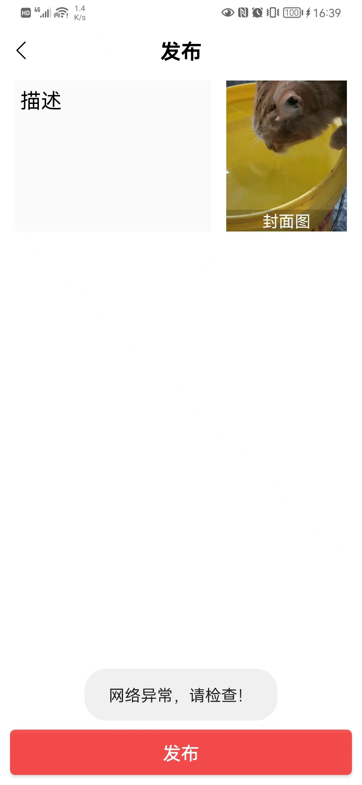
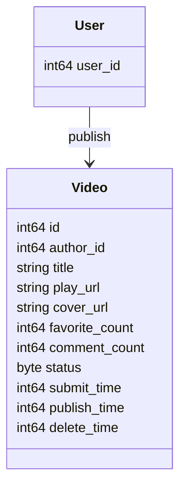
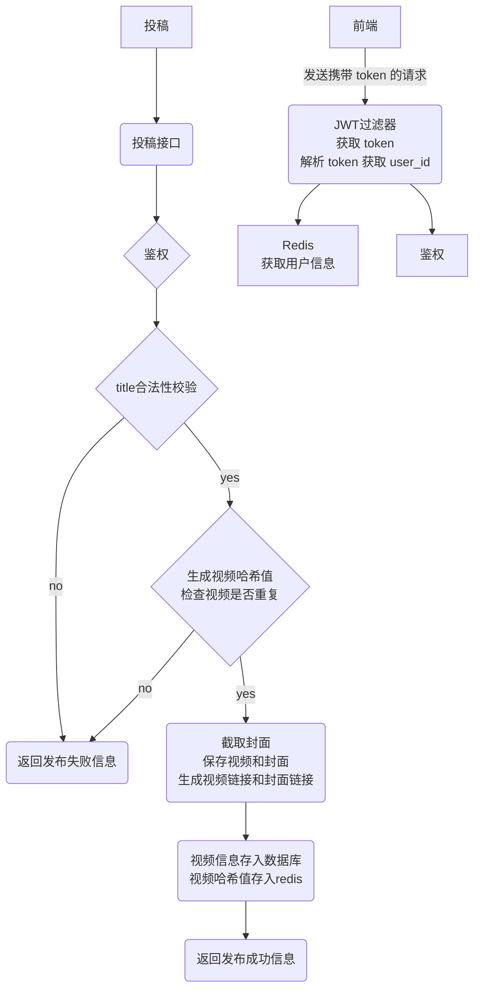

# 视频投稿

[接口](https://www.apifox.cn/apidoc/shared-09d88f32-0b6c-4157-9d07-a36d32d7a75c/api-50707520)：/douyin/publish/action/

## 功能描述

已登录的用户选择视频文件上传。

发布视频，在本页完成信息填充后，点击发布就会调用该接口。

发布完成会弹出发布完成提示信息，并自动关闭本页面、跳转到该视频。

~~用户可以选择图片，或从视频中截取一帧，作为视频的封面图。（貌似app没调这种接口）~~

根据视频哈希值判断视频是否与已发布视频重复，使用redis存储所有视频的哈希值。

按年月日的目录组织视频文件。（优化：GFS、[minio](https://github.com/minio/minio)、[go-fastdfs](https://sjqzhang.github.io/go-fastdfs/usage.html#go)）

> ## YouTube 是如何存储如此巨大的数据量的呢？
>
> 视频会存储在谷歌数据中心的硬盘中。这些数据由 Google File System 和 BigTable 管理。
>
> GFS Google File System是谷歌开发的一个**分布式文件系统**，用于管理分布式环境中的大规模数据。
>
> BigTable是一个建立在 Google File System 上的低延迟分布式数据存储系统，用于处理分布在成千上万台机器上的 PB 级别的数据。60 多个谷歌产品都使用了它。




## 表设计


```sql
DROP TABLE IF EXISTS `video`;
CREATE TABLE `video`  (
  `id` bigint(0) UNSIGNED NOT NULL AUTO_INCREMENT COMMENT '主键',
  `title` varchar(255) CHARACTER SET utf8 COLLATE utf8_general_ci NOT NULL COMMENT '投稿标题',
  `play_url` varchar(255) CHARACTER SET utf8 COLLATE utf8_general_ci NOT NULL COMMENT '投稿视频',
  `cover_url` varchar(255) CHARACTER SET utf8 COLLATE utf8_general_ci NOT NULL COMMENT '投稿封面',
  `favorite_count` bigint(0) NULL DEFAULT 0 COMMENT '点赞数',
  `comment_count` bigint(0) NULL DEFAULT 0 COMMENT '评论数',
  `status` tinyint(1) UNSIGNED DEFAULT 2 NOT NULL COMMENT '视频状态（0：已发布，1：已删除，2：审核中（冗余））',
  `submit_time` timestamp DEFAULT CURRENT_TIMESTAMP COMMENT '提交时间',
  `publish_time` timestamp DEFAULT NULL COMMENT '发布时间（冗余）',
  `delete_time` timestamp DEFAULT NULL COMMENT '删除时间'
  PRIMARY KEY (`id`) USING BTREE
) ENGINE = InnoDB CHARACTER SET = utf8 COLLATE = utf8_general_ci ROW_FORMAT = Dynamic;
```


## 投稿流程


